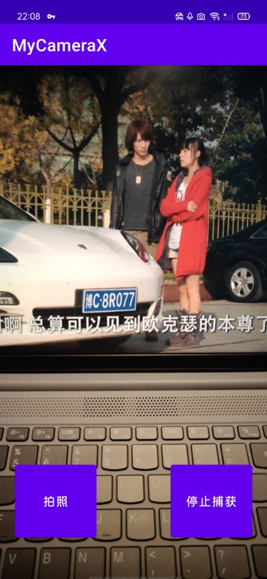

## 实现第一个Kotlin程序以及使用CameraX
### 第一个Kotlin程序
#### 实现思路：
1. 打开Android Studio，选择Projects>New Project，然后选择Basic Activity.
2. 设置两个Fragment的布局为约束布局
3. 配置依赖安全传递Fragment之间的参数（我的gradle版本是7.5，as版本为Electric Eel）
   - 在项目的build.gradle的buildscript中
   ```
    dependencies {
        def nav_version = "2.5.3"
        classpath("androidx.navigation:navigation-safe-args-gradle-plugin:$nav_version")
    }

   ```
   - 在模块的builde.gradle中添加
    ```
    dependencies {
    def nav_version = "2.5.3"

    // Java language implementation
    implementation("androidx.navigation:navigation-fragment:$nav_version")
    implementation("androidx.navigation:navigation-ui:$nav_version")

    // Kotlin
    implementation("androidx.navigation:navigation-fragment-ktx:$nav_version")
    implementation("androidx.navigation:navigation-ui-ktx:$nav_version")

    // Feature module Support
    implementation("androidx.navigation:navigation-dynamic-features-fragment:$nav_version")

    // Testing Navigation
    androidTestImplementation("androidx.navigation:navigation-testing:$nav_version")

    // Jetpack Compose Integration
    implementation("androidx.navigation:navigation-compose:$nav_version")
    }
    ```
4. 在SecondFragment的属性栏点击Arguments *+* 符号弹出的对话框中，添加参数myArg，类型为整型Integer
5. 设置随机数
    ```
    val showCountTextView = view.findViewById<TextView>(R.id.textview_first)
    
        // Get the value of the text view.
        val countString = showCountTextView.text.toString()

        // Convert value to a number and increment it
        var count = countString.toInt()
        val random = java.util.Random()
        count = count + random.nextInt(999);  //拿一个随机数
        showCountTextView.text = count.toString();
    ```
6. 在SecondFragment中显示
   ```
   val count = args.myArg
        val countText = getString(R.string.random_heading)
        view.findViewById<TextView>(R.id.textview_header).text = countText.substring(0,countText.length-2) + count.toString();
        val random = java.util.Random()
        var randomNumber = 0
        if (count > 0) {
            randomNumber = random.nextInt(count + 1)
        }
        view.findViewById<TextView>(R.id.textview_random).text = randomNumber.toString()
    ```
7. <p>运行截图<p> 
    
    
    
### CameraX的使用
1. 实现思路：
   - 依赖配置：在build.gradle的dependencies中添加依赖
    ```
    //CameraX依赖
    implementation "androidx.camera:camera-core:${camerax_version}"
    implementation "androidx.camera:camera-camera2:${camerax_version}"
    implementation "androidx.camera:camera-lifecycle:${camerax_version}"
    implementation "androidx.camera:camera-video:${camerax_version}"
    implementation "androidx.camera:camera-view:${camerax_version}"
    implementation "androidx.camera:camera-extensions:${camerax_version}"

    ```
   - 权限申请：android6.0后不仅要在清单文件中声明权限，还要在运行时动态申请权限(录像和拍照需要申请录像，拍照和外部存储权限)。
     - 清单文件：
    ```
    <uses-permission android:name="android.permission.CAMERA" />
    <uses-permission android:name="android.permission.RECORD_AUDIO" />
    <uses-permission android:name="android.permission.WRITE_EXTERNAL_STORAGE"

    ```
    - 动态申请：
    ```
    private fun allPermissionsGranted() = REQUIRED_PERMISSIONS.all {
        ContextCompat.checkSelfPermission(
            baseContext, it
        ) == PackageManager.PERMISSION_GRANTED
    }
    ```
2. 编写关键逻辑代码：
    ```
       val mediaStoreOutputOptions = MediaStoreOutputOptions
        .Builder(contentResolver, MediaStore.Video.Media.EXTERNAL_CONTENT_URI)
        .setContentValues(contentValues)
        .build()
        recording = videoCapture.output
       .prepareRecording(this, mediaStoreOutputOptions)
        .apply {
            if (PermissionChecker.checkSelfPermission(this@MainActivity,
                    Manifest.permission.RECORD_AUDIO) ==
                    PermissionChecker.PERMISSION_GRANTED)
                {
                    withAudioEnabled()
                }
            }
            .start(ContextCompat.getMainExecutor(this)) { recordEvent ->
                when(recordEvent) {
                    is VideoRecordEvent.Start -> {
                        viewBinding.videoCaptureButton.apply {
                            text = getString(R.string.stop_capture)
                            isEnabled = true
                        }
                    }
                    is VideoRecordEvent.Finalize -> {
                        if (!recordEvent.hasError()) {
                            val msg = "Video capture succeeded: " +
                                    "${recordEvent.outputResults.outputUri}"
                            Toast.makeText(baseContext, msg, Toast.LENGTH_SHORT)
                                .show()
                            Log.d(TAG, msg)
                        } else {
                            recording?.close()
                            recording = null
                            Log.e(TAG, "Video capture ends with error: " +
                                    "${recordEvent.error}")
                        }
                        viewBinding.videoCaptureButton.apply {
                            text = getString(R.string.start_capture)
                            isEnabled = true
                        }
                    }
                }
            }
    ```
3. 运行截图 <br>
    
    
    