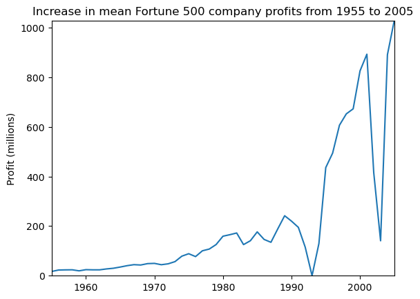
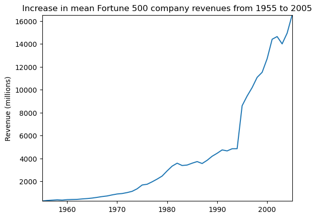

## Jupyter Notebook基础教程
#### 基本要求
1. 完成基于python的选择排序算法
   1. 实现函数selection_sort:
    ```
    def selection_sort(arr):
        n = len(arr)
        for i in range(n):
            # 找到剩余元素中最小的元素的索引
            min_index = i
            for j in range(i+1, n):
                if arr[j] < arr[min_index]:
                    min_index = j
            # 将最小元素与当前元素交换位置
            arr[i], arr[min_index] = arr[min_index], arr[i]
        return arr
    ```
    2. 实现函数test：
      ```
      def test():
        arr = []
        n = int(input("请输入数组长度："))
        for i in range(n):
            num = int(input("请输入第{}个元素：".format(i+1)))
            arr.append(num)
        sorted_arr = selection_sort(arr)
        print("排序后的结果为：", sorted_arr)
      ```
2. 数据分析的例子
   1. 导入相关的工具库
    ```%matplotlib inline
    import pandas as pd
    import matplotlib.pyplot as plt
    import seaborn as sns
    ```
    2.加载数据集。

    ```
    df = pd.read_csv('fortune500.csv')
    ```

    ```
    df.head()
    ```
    <table border="1" class="dataframe">
    <thead>
        <tr style="text-align: right;">
        <th></th>
        <th>year</th>
        <th>rank</th>
        <th>company</th>
        <th>revenue</th>
        <th>profit</th>
        </tr>
    </thead>
    <tbody>
        <tr>
        <th>228</th>
        <td>1955</td>
        <td>229</td>
        <td>Norton</td>
        <td>135.0</td>
        <td>N.A.</td>
        </tr>
        <tr>
        <th>290</th>
        <td>1955</td>
        <td>291</td>
        <td>Schlitz Brewing</td>
        <td>100.0</td>
        <td>N.A.</td>
        </tr>
        <tr>
        <th>294</th>
        <td>1955</td>
        <td>295</td>
        <td>Pacific Vegetable Oil</td>
        <td>97.9</td>
        <td>N.A.</td>
        </tr>
        <tr>
        <th>296</th>
        <td>1955</td>
        <td>297</td>
        <td>Liebmann Breweries</td>
        <td>96.0</td>
        <td>N.A.</td>
        </tr>
        <tr>
        <th>352</th>
        <td>1955</td>
        <td>353</td>
        <td>Minneapolis-Moline</td>
        <td>77.4</td>
        <td>N.A.</td>
        </tr>
    </tbody>
    </table>

    ```
    df.tail()
    ```

    3.对数据属性列进行重命名，以便在后续访问

    ```
    df.columns = ['year', 'rank', 'company', 'revenue', 'profit']
    ```
    4.检查数据条目是否加载完整。

    ```
    len(df)
    ```
    ```
    25500
    ```
    5.检查属性列的类型。

    ```
    df.dtypes
    ```
    ```
    year         int64
    rank         int64
    company     object
    revenue    float64
    profit      object
    dtype: object
    ```
    6.对于profit属性，期望的结果是float类型，因此其可能包含非数字的值，利用正则表达式进行检查。

    ```
    non_numberic_profits = df.profit.str.contains('[^0-9.-]')
    df.loc[non_numberic_profits].head()
    ```
    <table border="1" class="dataframe">
    <thead>
        <tr style="text-align: right;">
        <th></th>
        <th>year</th>
        <th>rank</th>
        <th>company</th>
        <th>revenue</th>
        <th>profit</th>
        </tr>
    </thead>
    <tbody>
        <tr>
        <th>228</th>
        <td>1955</td>
        <td>229</td>
        <td>Norton</td>
        <td>135.0</td>
        <td>N.A.</td>
        </tr>
        <tr>
        <th>290</th>
        <td>1955</td>
        <td>291</td>
        <td>Schlitz Brewing</td>
        <td>100.0</td>
        <td>N.A.</td>
        </tr>
        <tr>
        <th>294</th>
        <td>1955</td>
        <td>295</td>
        <td>Pacific Vegetable Oil</td>
        <td>97.9</td>
        <td>N.A.</td>
        </tr>
        <tr>
        <th>296</th>
        <td>1955</td>
        <td>297</td>
        <td>Liebmann Breweries</td>
        <td>96.0</td>
        <td>N.A.</td>
        </tr>
        <tr>
        <th>352</th>
        <td>1955</td>
        <td>353</td>
        <td>Minneapolis-Moline</td>
        <td>77.4</td>
        <td>N.A.</td>
        </tr>
    </tbody>
    </table>
    </div>
    7.profit这一列为字符串，统计一下到底存在多少条这样的记录。
    ```
    len(df.profit[non_numberic_profits])
    ```

    ```
    369
    ```
    8.使用直方图显示一下按照年份的分布情况。

    ```
    bin_sizes, _, _ = plt.hist(df.year[non_numberic_profits], bins=range(1955, 2006))
    ```
    

    9.单独年份这样的记录数都少于25条，即少于4%的比例。这在可以接受的范围内，因此删除这些记录。

    ```df = df.loc[~non_numberic_profits]
    df.profit = df.profit.apply(pd.to_numeric)
    ```
    10.再次检查数据记录的条目数。

    ```
    len(df)
    ```
    ```
    25131
    ```
    ```
    df.dtypes
    ```
    ```
    year         int64
    rank         int64
    company     object
    revenue    float64
    profit     float64
    dtype: object
    ```
    11.以年分组绘制平均利润和收入。首先定义变量和方法。

    ```
    group_by_year = df.loc[:, ['year', 'revenue', 'profit']].groupby('year')
    avgs = group_by_year.mean()
    x = avgs.index
    y1 = avgs.profit
    def plot(x, y, ax, title, y_label):
        ax.set_title(title)
        ax.set_ylabel(y_label)
        ax.plot(x, y)
        ax.margins(x=0, y=0)
    ```
    开始绘图

    ```
    fig, ax = plt.subplots()
    plot(x, y1, ax, 'Increase in mean Fortune 500 company profits from 1955 to 2005', 'Prof
    ```
    

    收入曲线。

    ```
    y2 = avgs.revenue
    fig, ax = plt.subplots()
    plot(x, y2, ax, 'Increase in mean Fortune 500 company revenues from 1955 to 2005',
    ```
    

    12.对数据结果进行标准差处理。

    ```
    def plot_with_std(x, y, stds, ax, title, y_label):
        ax.fill_between(x, y - stds, y + stds, alpha=0.2)
        plot(x, y, ax, title, y_label)
    fig, (ax1, ax2) = plt.subplots(ncols=2)
    title = 'Increase in mean and std Fortune 500 company %s from 1955 to 2005'
    stds1 = group_by_year.std().profit.values
    stds2 = group_by_year.std().revenue.values
    plot_with_std(x, y1.values, stds1, ax1, title % 'profits', 'Profit (millions)')
    plot_with_std(x, y2.values, stds2, ax2, title % 'revenues', 'Revenue (millions)')
    fig.set_size_inches(14, 4)
    fig.tight_layout()
    ```
    