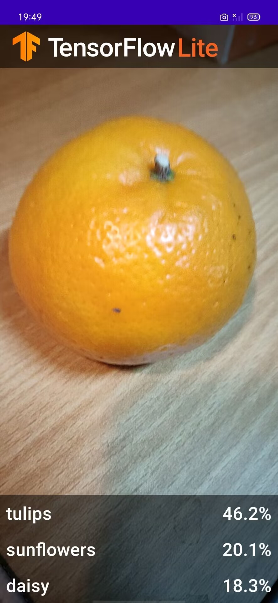

## 基于TensorFlow Lite实现的Android花卉识别应用
#### 基本思路
1. 使用TensorFlow Lite Model Maker训练自定义的图像分类器
2. 利用Android Studio导入训练后的模型，并结合CameraX使用
3. 利用手机GPU加速模型运行
#### 实现步骤
1. 创建一个工作目录 使用：
     ```git clone https://github.com/hoitab/TFLClassify.git```
    
    下载TFLClassify
2. 定位“start”模块MainActivity.kt文件的TODO编写代码
    ```
    private class ImageAnalyzer(ctx: Context, private val listener: RecognitionListener) :
            ImageAnalysis.Analyzer {
    ...
    // TODO 1: Add class variable TensorFlow Lite Model
    private val flowerModel = FlowerModel.newInstance(ctx)

    ...
        }   
    ```

    ```
    override fun analyze(imageProxy: ImageProxy) {
    ...
    // TODO 2: Convert Image to Bitmap then to TensorImage
    val tfImage = TensorImage.fromBitmap(toBitmap(imageProxy))
    ...
    }
    ```
    ```
    override fun analyze(imageProxy: ImageProxy) {
    ...
    // TODO 3: Process the image using the trained model, sort and pick out the top results
    val outputs = flowerModel.process(tfImage)
        .probabilityAsCategoryList.apply {
            sortByDescending { it.score } // Sort with highest confidence first
        }.take(MAX_RESULT_DISPLAY) // take the top results

    ...
    }
    ```
    ```
    override fun analyze(imageProxy: ImageProxy) {
    ...
    // TODO 4: Converting the top probability items into a list of recognitions
    for (output in outputs) {
        items.add(Recognition(output.label, output.score))
    }
    ...
    }
    ```
    将原先用于虚拟显示识别结果的代码注释掉或者删除
    ```
    // START - Placeholder code at the start of the codelab. Comment this block of code out.
    for (i in 0..MAX_RESULT_DISPLAY-1){
        items.add(Recognition("Fake label $i", Random.nextFloat()))
    }
    // END - Placeholder code at the start of the codelab. Comment this block of code out.
    ```
3. 运行截图 <br>
   
   
